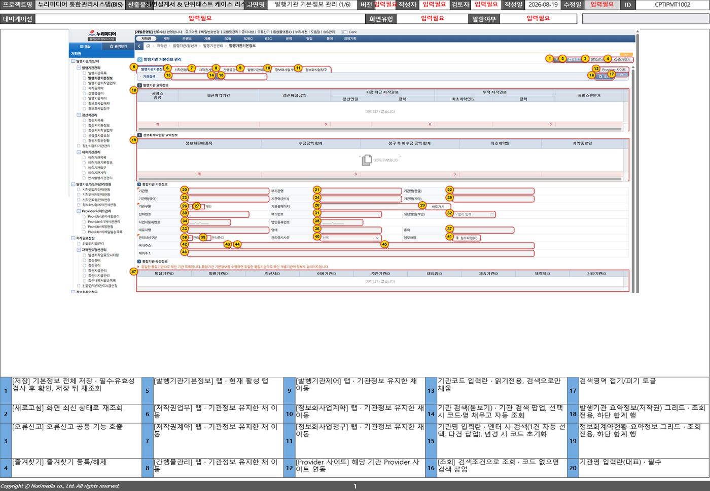
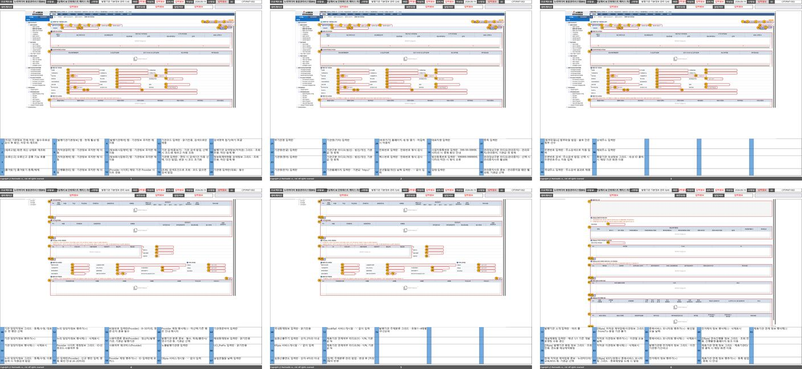
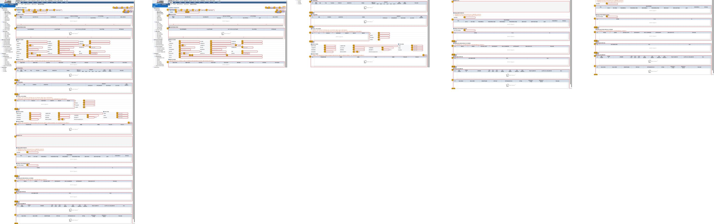

# excel-wireframe

**Excel 화면설계서를 PowerPoint 화면설계서로 자동 생성하는 Claude Skill**

| | |
|---|---|
| 산출물 | Claude Code Skill (Python 3.13) |
| 기간 | 2026.08.04 – 08.19 · 16일 |
| 역할 | 설계 · 구현 · 테스트 전 과정 단독 |
| 스택 | python-pptx · openpyxl · Pillow · NumPy · pytest |
| 규모 | 스크립트 3,521줄 / 테스트 4,934줄 (17개 모듈, 테스트 함수 283개) |
| 검증 | `python -m pytest -q` 283건 전부 통과 |

화면마다 스크린샷과 상세 표가 들어찬 Excel 설계 시트를 받아, 스크린샷을 자르고 상세 설명을
슬롯에 흘려 넣어 실무 양식 그대로의 PowerPoint 화면설계서를 만든다. 사람이 판단하는 지점은
세 곳뿐이고 나머지는 전부 결정론적으로 처리한다.

- 상세 93건짜리 화면 하나 → 슬라이드 6장, **2.5초** (extract 0.67s + build 1.79s)
- 화면 단위로 예외를 격리하고 **9종 경고 코드**로 보고

---

## 문제 — 같은 내용을 두 번 쓰는 일

SI 현장의 화면설계서는 두 번 만들어진다. 분석 단계에서는 Excel에 쓴다 — 화면마다 시트를 만들고
스크린샷을 붙인 뒤 `No. / 요소타입 / 요소명 / 상세 설명 / 위치` 표를 채운다. 납품 단계에서는
그 내용을 PowerPoint 양식으로 다시 옮긴다.

옮기는 작업 자체에는 판단이 거의 없는데도 손이 많이 간다. 스크린샷이 세로로 길면 한 장에 안 들어가
적당한 데서 잘라 여러 장으로 나눠야 하고, 잘랐으면 상세 설명도 그 조각에 보이는 것들만 골라
따라가야 한다. 설명이 칸을 넘치면 글자 크기를 줄이고, 화면이 40개면 이 일을 40번 한다.

특정 양식에 하드코딩하지 않는다. 처음 보는 Excel이 들어와도 구조를 스캔해 매핑을 제안하고,
사용자 확인을 거쳐 생성한다. PPT 템플릿을 주면 그 디자인을 유지하고, 안 주면 기본 템플릿을
만들어 진행한다.

---

## 결과물

*화면 하나의 1/6 장.* 상단 메타 표의 프로젝트명·화면명·ID·작성일은 Excel 표지 시트에서 읽어
채웠고, 값을 못 찾은 칸은 비워 두지 않고 빨강 `입력필요`로 남긴다 — 빈 칸은 채우는 걸 잊은 건지
원래 값이 없는 건지 구별되지 않기 때문이다. 스크린샷의 노란 SoM 뱃지 번호와 하단 표의 번호가
대응한다. 하단 표는 4행짜리 표 5개가 가로로 놓인 20슬롯이고, 상세는 표1 r0…r3 → 표2 r0…r3
순으로 흘러 들어간다.

*화면 1개 → 슬라이드 6장.* 스크린샷이 세로로 길어 4조각으로 나뉘고, 상세 93건이 20슬롯을
넘겨 다시 나뉜 결과다. 사진과 표의 자리는 여섯 장 모두 같다 — 장을 넘길 때 상단 기준선이
흔들리지 않게 본문 영역 높이에 대한 고정 비율로 잡는다.

---

## 파이프라인 — 판단은 세 곳, 나머지는 스크립트

LLM에게 전 과정을 맡기지 않았다. 좌표 계산과 XML 조작은 스크립트가 결정론적으로 처리하고,
Claude는 구조를 읽고 판단해야 하는 세 지점에만 개입한다. 중간 산출물을 파일로 떨어뜨려 단계를
끊었기 때문에, 매핑만 고쳤을 때 느린 이미지 추출을 다시 돌리지 않아도 된다.

| 단계 | 주체 | 산출물 |
|---|---|---|
| `analyze.py` | 스크립트 | Excel·PPT 구조 스캔 → `structure-report.json` |
| `mapping.json` | **판단 ①** | 시트 레이아웃·제외 시트·헤더 마커·도형 이름을 정하고 표로 사용자 확인 |
| `extract.py` | 스크립트 | 화면·상세·이미지 → `screens.json`, `images/` |
| `summaries.json` | **판단 ②·③** | 추출 결과 보고, 긴 상세를 개조식 한 줄로 요약 |
| `build.py` | 스크립트 | 슬라이드 생성·이미지 분할·넘침 분할 → `*.pptx` |
| `verify.py` | 스크립트 | 만든 파일을 다시 열어 도형·이미지·항목 수 재검사 |

마지막이 `verify.py`인 이유는, 파일이 만들어졌다는 사실만으로는 아무것도 보장되지 않기 때문이다.
도형 이름이 어긋나거나 관계(rId)가 깨지면 pptx는 정상적으로 저장되지만 내용이 비어 있다.

---

## 기술 결정

### 1. 긴 스크린샷을 어디서 자를 것인가 (`image_split.py`)

세로 3,164px 스크린샷은 한 장에 넣으면 글자를 읽을 수 없고, 일정 높이로 기계적으로 자르면 표
한가운데가 끊긴다. **가로로 이어진 밝은 여백 띠**(색 분산이 낮고 밝은 행이 5px 이상 연속되는
구간)를 섹션 경계로 보고 거기서 자른다. 목표 높이는 상한이 아니라 참고값이다 — 섹션이 끊기느니
조각이 길어져 조금 축소되는 편이 낫다. 좌측 네비게이션은 세로로 계속 이어져 여백 판단을
방해하므로 폭의 12%를 판정에서 제외한다.

자른 뒤에는 상세를 조각에 배분해야 한다. 스크린샷에 찍힌 노란 SoM 뱃지가 **각 조각에 몇 개
들어가는지 세어** 그 수만큼 상세를 나눠 준다. 뱃지 안의 숫자는 읽지 않는다 — 위치로 순서를
추정해 봤지만 같은 줄 뱃지들의 y좌표가 몇 px씩 어긋나 행 묶음 임계값 하나로 가를 수 없었다.
개수만 세면 행 안의 순서가 틀려도 구간 경계만 맞으면 결과가 정확하다. **정확도를 올리는 대신
틀릴 수 있는 부분을 문제에서 뺐다.**

*왼쪽이 원본(1904 × 3164px), 오른쪽이 자동 분할 결과 4조각.* 섹션 헤더 바로 아래 틈에서는
자르지 않는다 — 거기서 자르면 제목만 앞 장에 남고 내용이 다음 장으로 넘어간다.

### 2. PowerPoint는 레이아웃의 표를 물려주지 않는다 (`slide_layout.py`)

상단 메타 표를 레이아웃에 두고 슬라이드마다 값만 채우려 했는데, PowerPoint는 레이아웃 도형 중
**placeholder만 슬라이드로 상속**한다. 표는 상속되지 않아 값을 쓸 대상이 없다.

표를 슬라이드로 복제해 덮는 방법을 먼저 시도했다가 되돌렸다 — 표가 두 겹이 되어 원본을 클릭할 수
없고 테두리가 두 번 그려졌다. 최종 해법은 원본 표는 그대로 두고 칸 자리에 글자만 얹는 것
(`add_meta_text_slots`)이다. 빈 자리에 글자를 넣을 때는 그 자리가 `endParaRPr`에 품고 있는
서식을 물려받게 했다 — 그냥 런을 만들면 크기가 상속 기본값(18pt)으로 떨어져 칸이 부푼다.

### 3. 계산과 산출물이 다른 식을 쓰면 표가 어긋난다 (`text_metrics.py`)

상세가 칸을 넘치는지 미리 알아야 글자를 줄일 수 있다. 폰트 파일을 읽어 정확히 재는 대신
**전각/반각만 구분해 폭을 누적**하는 근사를 썼다 — 상세는 대부분 한글이라 충분하고, 의존성을
늘릴 만큼의 정확도 차이가 아니었다.

중요한 건 정확도보다 **일관성**이었다. 줄 수를 세는 쪽과 실제 셀 서식을 쓰는 쪽이 다른 줄간격·여백
값을 쓰면 계산은 맞는데 표가 자리에 안 맞는다. 줄간격(`0.95`)과 셀 여백을 상수 하나로 모으고,
폭 기준은 `slide_layout.detail_text_width`, 행 높이 기준은 `ratio_row_heights`를 단일 출처로
삼았다.

넘칠 때 표를 늘리지 않고 글자를 줄이는 것(7 → 6.5 → 6pt)도 같은 이유다. 표를 늘리면 화면마다
사진 크기가 달라져, 장을 넘길 때 눈이 따라가는 상단 기준선이 흔들린다. 6pt로도 안 되면
`text-overflow` 경고로 알린다.

### 4. 빌드 단계가 Excel을 모르게 강제한다 (`build.py` / `tests/test_build.py`)

`screens.json`은 사람이 고치는 파일이 아니라 재추출 때 그냥 덮어쓰는 캐시다. 그래도 파일로
떨어뜨린 이유는 **openpyxl 의존을 추출 계열에 가두기** 위해서다. `build.py`가 Excel을 모르면
배치 로직을 Excel 픽스처 없이 단위 테스트할 수 있고, 결과가 이상할 때 추출이 틀렸는지 배치가
틀렸는지 갈라 볼 수 있다. 이 경계는 규칙 문서에만 적어 두면 언젠가 깨지므로,
`tests/test_build.py`가 **소스 파일을 읽어** openpyxl import가 있는지 검사해 실패시킨다.

---

## 실패 설계 — 한 화면이 실패해도 나머지는 완성된다

40개 화면 중 3개의 매핑이 어긋났다고 전체가 죽으면, 사용자는 아무것도 손에 쥐지 못한 채 원인을
찾아야 한다. 예외는 화면 단위로 격리한다. 실패한 화면은 `[생성 실패]` 표시로 남고 나머지는 정상
생성되며, 무슨 일이 있었는지는 경고 코드로 보고된다. 코드는 아홉 개로 고정했고 — 늘어나면 아무도
읽지 않는다 — `tests/test_warning_codes.py`가 목록 밖의 코드가 생기는 것을 막는다.

| 코드 | 뜻 | 사용자가 할 일 |
|---|---|---|
| `no-image` | 화면에 연결된 이미지를 찾지 못했다 | 이미지 귀속 매핑 재검토 |
| `no-detail` | 상세 표 헤더를 찾지 못했다 | 헤더 마커 값 확인 |
| `text-overflow` | 글자를 줄여도 설명이 셀을 넘길 수 있다 | 요약을 더 줄이기 |
| `shape-not-found` | 매핑이 가리킨 도형이 템플릿에 없다 | 도형 이름 수정 |
| `slide-split` | 상세가 슬롯을 넘어 여러 장으로 나눴다 | 확인만 (정상 동작) |
| `slot-shortage` | 상세 중 일부만 이 슬라이드에 들어갔다 | 슬롯 수 확인 |
| `screen-failed` | 이 화면의 슬라이드 생성이 실패했다 | 해당 화면 매핑 점검 |
| `image-convert-failed` | 이미지 변환에 실패했다 | 원본 이미지 형식 확인 |
| `orphan-row` | 화면ID가 없는 행이라 건너뛰었다 | Excel 원본 확인 |

---

## 품질 — 테스트가 규칙을 대신 지킨다

이 프로젝트의 버그는 대부분 **실행은 되는데 결과가 틀린** 종류다. pptx는 XML 묶음이라 도형 이름
하나가 어긋나도 예외 없이 빈 파일이 만들어진다. 그래서 테스트를 산출물 쪽으로 밀어붙였다 —
스크립트 3,521줄에 테스트 4,934줄, 함수 283개다.

1. **산출물을 다시 열어 검사한다.** 생성한 pptx를 python-pptx로 재파싱해 도형·이미지·상세 건수를
   확인한다. 파일 존재 여부는 검증이 아니다.
2. **설계 규칙을 소스 검사로 강제한다.** `build.py`의 openpyxl 금지, 경고 코드 아홉 개 고정처럼
   사람이 지켜야 하는 규칙은 테스트가 검사한다.
3. **픽스처를 코드로 만든다.** 테스트용 pptx를 따로 두지 않고 `default_template.build_default_template`으로
   매번 생성한다. 템플릿 구조가 바뀌면 픽스처도 같이 따라온다.
4. **실물 회귀는 있으면 돌리고 없으면 건너뛴다.** 실제 납품 문서로 하는 E2E 테스트는 저작권 때문에
   저장소에 넣을 수 없어, 파일이 없으면 자동 skip한다.

---

## 진행 방식 — 설계 문서를 먼저 쓰고, 실물로 되돌아왔다

16일 동안 커밋 86개. 그중 `docs:` 커밋이 21개로 `fix:`와 같다. 기능을 짜기 전에 설계 문서를 쓰고
(`docs/superpowers/specs/` 9건), 구현 계획으로 쪼갠 뒤 작업했다. 방향을 갈아엎은 주제는 설계
문서가 두 벌 남아 있다 — `table-height-fit`(표를 내용에 맞춰 늘린다)을 쓰고 구현했다가, 화면마다
사진 크기가 달라지는 걸 실물로 보고 `table-height-shrink`로 뒤집었다.

되돌아온 지점은 항상 실물이었다. 커밋 로그에 `v1_글자 입력 자리 없음`,
`v2_기본 화면설계서 및 화면 이미지 자동 분할`, `v3_표셀 크기 조정`, `v4_폴더 변경, 헤더 고아`
네 개의 표식이 있다. 실제 Excel로 PPT를 뽑아 PowerPoint로 열어 보고, 눈에 걸리는 것을 그대로 다음
사이클의 제목으로 삼았다. *헤더 고아*는 그렇게 발견한 버그다 — 섹션 제목만 앞 장에 남고 내용이
다음 장으로 넘어가 있었다.

Claude Code로 개발했고, 그 과정에서 얻은 규칙은 `CLAUDE.md`에 축적했다. "표 셀에 값을 쓸 때는
런을 새로 만들지 말 것", "슬라이드 복제는 rId를 재매핑할 것" 같은, 한 번 데어 봐야 아는 것들이다.

| 커밋 유형 | 건수 | 비중 |
|---|---:|---:|
| feat — 기능 | 29 | 34% |
| fix — 수정 | 21 | 24% |
| docs — 설계·계획·문서 | 21 | 24% |
| test / refactor / chore | 10 | 12% |
| 버전 표식 (v1–v4 실사용 점검) | 4 | 5% |

---

## 한계 — 아직 못 하는 것

- **상세표는 항상 사진 아래에 놓인다.** 스크린샷이 세로로 길면 좌우가 통째로 비고, 분할이
  불필요하게 여러 조각으로 일어난다. 표를 옆으로 옮기는 설계는 써 뒀지만 구현하지 않았다 —
  슬롯이 20개에서 16개로 줄어드는 것을 받아들일지가 미결이다.
- **메타 표의 칸은 열두 개로 고정이다.** 표지에서 그보다 많은 값을 읽어와도 꽂을 자리가 없다.
  템플릿 표에 칸을 늘리고 라벨을 추가하면 코드 수정 없이 채워지도록은 해 뒀다.
- **사용자 템플릿의 레이아웃에 박힌 요소는 건드리지 못한다.** 상단 띠·하단 바가 슬라이드가 아니라
  레이아웃에 있으면 PowerPoint에서 직접 고쳐야 한다.
- **설치본이 저장소와 따로 논다.** Claude Code가 스킬을 읽는 위치는 `~/.claude/skills/`라,
  스크립트를 고치면 다시 복사해야 한다. 배포 스크립트가 없다.
